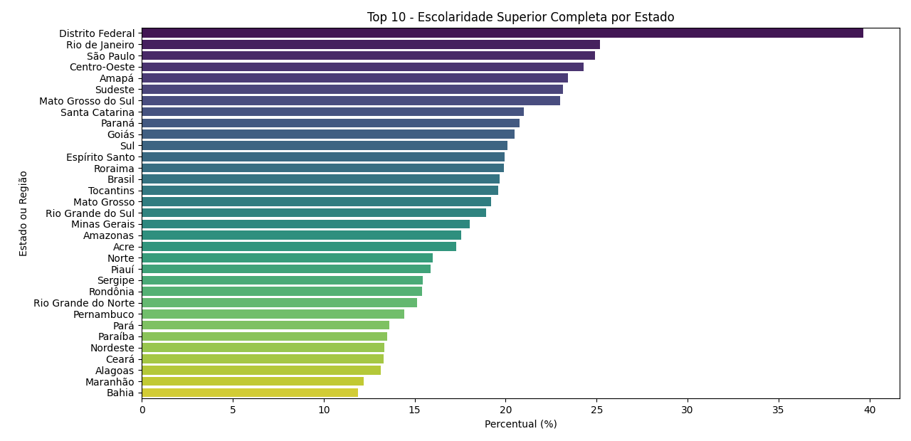

# 📊 Análise do Nível de Instrução no Brasil – IBGE

Este projeto realiza uma análise exploratória dos dados de nível de escolaridade no Brasil, com foco na porcentagem de pessoas com **ensino superior completo** por estado e região. Os dados foram obtidos da **Tabela 4.9 - Nível de Instrução - IBGE**.

## 🧠 Objetivo

Investigar e visualizar os níveis de escolaridade da população brasileira, com destaque para o **ensino superior**, promovendo insights sobre desigualdade educacional entre estados e regiões.

## 📁 Estrutura do Projeto

analise-nivel-instrucao-ibge/ ├── notebooks/ │ ├── escolaridade_superior.ipynb # Notebook principal da análise │ ├── escolaridade_superior.png # Gráfico gerado na análise │ └── dados/ │ └── Tabela_4.9_NivelInstru_Geo.xls # Base de dados do IBGE

markdown
Copiar
Editar

## 🔧 Tecnologias Utilizadas

- Python 🐍
- Pandas 🐼
- Matplotlib 📈
- Seaborn 🌊
- Jupyter Notebook 📒

## 📷 Gráfico Exemplo

## ✅ Etapas Realizadas

- Carregamento e limpeza dos dados
- Análise estatística descritiva
- Geração de ranking dos estados com maior nível de ensino superior
- Visualização com gráfico de barras horizontais

## 👩‍💻 Desenvolvido por

**Suéling Nunrberg Meurer**  
[GitHub: sueling13](https://github.com/sueling13)

---
